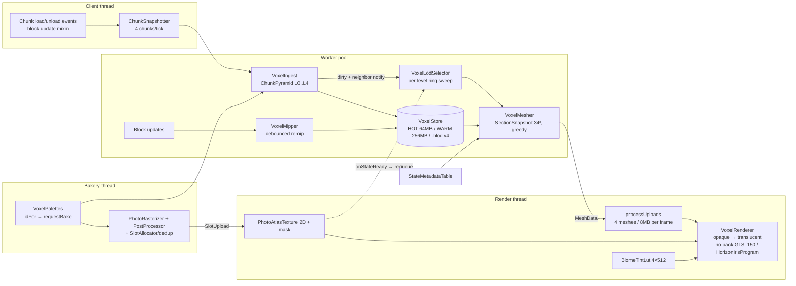

> Unified design for the Horizon full-voxel LOD rework (branch `feature/lod-voxel-rework`).
> Slice designs referenced as A/B/C: [design-data-storage.md](design-data-storage.md), [design-bakery-atlas.md](design-bakery-atlas.md), [design-mesh-render.md](design-mesh-render.md).
> Clean-room constraint: techniques inspired by Voxy (all-rights-reserved) are reimplemented from behavioral description only - no code or shader ported.

# Horizon Full-Voxel LOD — Unified Design (Integration Pass)

## 0. Cross-check verdicts & resolutions

All three designs were checked against each other for bit layouts, thread ownership, coordinate math, GL floor, budgets, lifecycle, and naming. **9 contradictions found and resolved:**

| # | Conflict | Resolution |
|---|---|---|
| R1 | **Cell bit layout**: A puts state at bits 0–19, biome 20–28, light 29–36; C claims light at 56–63, biome 47–55, state 27–46 | **A wins** (A owns the data model). C's mesher uses `VoxelCell` accessors only; C's faceKey becomes `(c & ~LIGHT_MASK) \| (lightBits(n) << 29)` with `LIGHT_MASK = 0xFFL << 29`. The vertex-format `lightMeta` u16 (sky 0–3, block 4–7) is unchanged — it is a separate packing written by the vertex writer. |
| R2 | **Photo atlas topology**: B specifies `GL_TEXTURE_2D_ARRAY` (grid-in-layer, 24,576-slot cap); C specifies a single 2D atlas 2048²→4096² | **C wins**: plain `GL_TEXTURE_2D`, `GL_RGBA8`, 5 real mips, 16-px slot grid, 2048² (16,384 slots) growing once to 4096² (65,536 slots — exactly u16 `atlasSlot`). B's layer-limit motivation disappears in 2D (GL4.1 guarantees `GL_MAX_TEXTURE_SIZE ≥ 16384`); 2D needs no third coordinate, and capacity exceeds B's array cap. **Everything else from B survives**: bake pipeline, dedup/intern, CPU shadow store (which is what makes growth a re-upload, since `glCopyImageSubData` is 4.3), sampler `NEAREST_MIPMAP_LINEAR/NEAREST`, `MAX_LEVEL=4`, `MAX_LOD=min(4, mipmapLevels)`, `CLAMP_TO_EDGE`. Mask atlas: 2D `GL_R8`, same geometry. |
| R3 | **Mask mip filter**: B averages, C uses max() | **B wins** (average). Averaged coverage gives correct partial-tint fade at distance; max() over-tints mixed faces. |
| R4 | **Level-ring formula**: C's `levelFor` code yields L0 out to 2048 m — off by one ring vs both A's table and C's *own* region-count table | The **tables win** (they agree): `level = dist < ringWidth ? 0 : min(4, 1 + floor(log2(dist/ringWidth)))`, collar test unchanged. C's code snippet is corrected accordingly. |
| R5 | **"Region" means two things**: A's storage region (8×8 sections/file) vs C's draw region (4×4 sections/mesh) | Both kept, **renamed**: `STORAGE_REGION_BITS = 3` (files, `VoxelRegionStorage`) and `MESH_REGION_SECTIONS = 4` (draw unit, `VoxelRegionMesh`). A mesh region = ¼ of a storage region in XZ. Docs/code must never say bare "region". |
| R6 | **Metadata duplication**: C invents `PhotoAtlasIndex` (slot/opacity/tint/topMip tables) overlapping B's `StateMetadataTable`/`PhotoMetadata` | **B's `StateMetadataTable` is the single source**; `PhotoAtlasIndex` is deleted. Mesher reads `PhotoMetadata` directly (lock-free volatile array). Split of concerns with A: **occlusion** (face culling) uses `VoxelPalettes.opacityOf(stateId)` — available at registration, never waits on a bake; **translucency routing + slots + colors + tint** use `PhotoMetadata`. Provisional records get a cheap `TRANSLUCENT` guess from `!state.canOcclude()`, corrected by the real bake (a remesh follows via `onStateReady` anyway). |
| R7 | **Y_BIAS=512 breaks exotic dimensions**: A's key supports minY to −4096; C's fixed bias only covers minY ≥ −512 | Per-dimension bias: `yBias = 16 * ceil(max(0, −dimMinY)/16)` (multiple of 16 preserves `fract` phase at every level). Vanilla overworld ⇒ 512, so C's math is unchanged in practice. Renderer already passes bias via `u_offset`. |
| R8 | **Leaf/opacity source of truth**: A computes leaves-forced-15 in `VoxelPalettes`; B declares `LeafLikePredicate` the shared truth | Both, layered: `LeafLikePredicate` (model pkg) is the predicate; `VoxelPalettes` **calls it** when computing the opacity byte. One truth, two consumers, no drift. |
| R9 | **`tintKind` widths**: B's metadata has 5 kinds incl. `BAKED`; C's vertex `faceMeta` has 2 bits (4 kinds) | No widening needed: `BAKED` means tint is already in the pixels, so the mesher writes vertex `tintType = 0 (NONE)` for `BAKED`. Mapping documented in the vertex writer. |

**Contract additions surfaced by cross-check** (gaps, not conflicts): (a) `MeshData` must carry the set of state ids it used (small `IntOpenHashSet` or bitset over palette) so `Listener.onStateReady` can re-queue exactly the affected mesh regions — B assumed it, C never provided it; (b) A's ingest merge step must dirty-notify the **6 face-neighbor sections'** mesh regions on section-*create* (C's missing-neighbor=AIR rule requires it or frontier walls persist); (c) `VoxelSection` gains a strided copy `copyPlaneInto(...)` for C's neighbor-plane pulls (8 KB/plane) alongside `copyCellsInto`; (d) the bakery's per-face photo orientation table must be expressed in DH normal order `{-Y,+Y,-Z,+Z,-X,+X}` — same table constant consumed by mesher and shader (`u_faceAxes`), locked by the furnace/grass acceptance tests.

**Checks that passed:** SectionKey (26/26/8/4) vs mesh-region key (29/29/6) are distinct keys, both internally consistent; A's L0 y∈[−2,9] (12 sections) matches C's sections-per-column table; parent/child octree math (`>>1` arithmetic) consistent; A ring table = C ring table; GL floor clean everywhere (worst constructs: `glGetTexImage`, `glDrawElementsBaseVertex` GL3.2, `glTexImage2D` mutable storage, GLSL 150 with integer attribs — all ≤4.1, no compute/SSBO/MDI/DSA/texStorage); v3 classic files and v4 voxel files live in disjoint subtrees (`<dim>/r.*` vs `<dim>/voxel/L<n>/r.*`), both engines coexist behind `engine=classic|voxel`; 96 B/quad equals today's cost; epoch schemes (atlasEpoch, jobEpoch) mirror existing `HorizonLod` machinery.

---

## 1. Overview

## 2. Packages & classes

**`net.irisshaders.iris.horizon.voxel`** (engine core, from A + C):

| Class | Responsibility |
|---|---|
| `VoxelConstants` | all shared constants (§6) — single home, C's dupes of A's constants merged here |
| `VoxelCell` / `SectionKey` | bit pack/unpack (§3); parent/octant math |
| `VoxelSection` / `SectionPool` | 32³ grid, monitor, population mask, dirty/version; bounded `long[32768]` free-list (64 arrays) |
| `VoxelWorld` / `VoxelStore` / `VoxelPalettes` | residency CHM; HOT/WARM/disk state machine; global state+biome palettes + opacity/leaf caches (via `LeafLikePredicate`), NBT persistence, palette-first save invariant |
| `ChunkSnapshotter` / `VoxelIngest` / `ChunkPyramid` / `VoxelMipper` | client-thread copies; worker convert→pyramid→merge (writes all 5 levels); representative selection (opacity DESC, count DESC, index), light avg (block floor / sky ceil); debounced incremental remip |
| `VoxelSectionCodec` / `VoxelRegionStorage` | UNIFORM/BITPACK/RLE/RAW rows; 8×8-section gzip region files, atomic tmp+move, quarantine |
| `VoxelEngine` | glue: queues, budgets, tick/save cadence, level lifecycle, engine toggle, `Listener.onStateReady` remesh re-queue |
| `MixinClientLevel_Horizon` | `setServerVerifiedBlockState` hook |
| `SectionSnapshot` / `VoxelMesher` (+`MeshData`) / `LodVertexFormatV2` | 34³ view (missing neighbor = AIR); greedy scanline per 6 faces, level-blind; MeshData carries used-stateId set |
| `VoxelRegionMesh` / `SharedQuadIndexBuffer` / `VoxelRenderer` / `NoPackVoxelShader` | dual-VAO mesh, global u32 EBO, frame loop + iris path + `onPipelineDestroyed` |
| `BiomeTintLut` / `BiomeTintTable` / `DhMaterialMapper` / `VoxelLodSelector` / `VoxelRegionKey` | GPU LUT + CPU mirror; DH material bytes; ring/level math (R4 formula) |

**`net.irisshaders.iris.horizon.voxel.model`** (bakery, from B): `VoxelModelBakery` (facade), `AtlasSnapshot`, `BakeWorker`, `PhotoRasterizer`, `RasterResult`/`FacePhoto`, `PhotoPostProcessor`, `ColorSpace`, `TintClassifier`, `LeafLikePredicate`, `DhMaterials` (merged with `DhMaterialMapper` — one class, model pkg, both uses), `PhotoSlotAllocator`, `PhotoAtlasTexture` (now 2D per R2), `StateMetadataTable`/`PhotoMetadata`.

## 3. Final bit/byte layouts

**Cell (64-bit, authoritative per R1):** bits 0–19 stateId (0=air) · 20–28 biomeId (0=plains) · 29–32 blockLight · 33–36 skyLight · 37–63 reserved-zero (v4).

**SectionKey (64-bit):** 0–25 x (biased +2²⁵) · 26–51 z · 52–59 y (biased +128) · 60–63 level. Cell index `(y<<10)|(z<<5)|x`.

**Mesh-region key:** bits 0–28 rx (biased) · 29–57 rz · 58–63 level.

**Storage row (.hlod v4):** as Design A §6 verbatim (MAGIC `HLOD`, VERSION 4, per-row key/nonAir/mask/encoding/payload; encodings 3=UNIFORM, 1=BITPACK, 4=RLE, 2=RAW>4096).

**Vertex v2 (24 B, 4 verts/quad, indexed = 96 B/quad):** as Design C §2 verbatim — u16 pos×3 (per-dim yBias per R7), u16 lightMeta, 4×u8 color (flat: `faceAvgColor × biomeTint`), u8 dhMaterial, u8 normalIdx, 2×u8 zero, u16 atlasSlot, u16 biomeId, u8 faceMeta (face 0–2, tintType 3–4 with BAKED→NONE per R9, maskBit 5), u8 flags, u16 pad. Two VAOs on one VBO (voxel: attribs 0–3; iris: 0–2 byte-compatible with patched `dh_terrain`).

**Atlas slot (per R2):** `slot ∈ [0, 65536)`, `x = (slot % slotsPerRow)*16`, `y = (slot / slotsPerRow)*16`; mip k holds `16>>k` px/slot; mip 4 texel = `faceAvgColor`.

## 4. Thread model (end-to-end)

| Thread | Owns | Budget/frame or tick |
|---|---|---|
| Client (main) | event enqueue; snapshot copies (4 chunks/tick); light-refresh mini-copies; block-update enqueue (256/tick); biome-LUT row eval | ~0.5 ms |
| Worker pool (shared with existing HorizonLod pool) | convert+pyramid+merge; remip (64 sections/pass); mesh jobs (SectionSnapshot reads via `tryAcquireRead`); region IO, save cycle, eviction | 1–3 ms/chunk; mesh jobs unbounded off-frame |
| Bakery thread (1, MIN_PRIORITY+1) | getQuads, rasterize, post-process, dedup/intern, CPU shadow | 50–200 µs/bake |
| Render thread | atlas snapshot capture; SlotUploads (32 faces/frame); bake retries (4/frame); mesh uploads (4 meshes AND ≤8 MB/frame); atlas growth; LUT subimage; both draw passes; all GL destroy | bounded |

GL is touched by exactly one thread. Cross-thread handoffs: MPSC queues + epoch stamps (atlasEpoch, jobEpoch); stale results dropped at the render-thread gate.

## 5. Memory budgets (defaults: `lodDistance` 4096 m, `voxelMemoryBudgetMb` 256, `maxLodVramMb` 512)

| RAM | Worst | VRAM | Typical → Worst |
|---|---|---|---|
| HOT sections | 64 MB | Mesh VBOs L0/L1/L2 | 175–295 MB |
| WARM (config) | 256 MB | Photo atlas 2048² (+mask) | 28 MB → 111 MB at 4096² |
| Pool + snapshots + scratch | 33 MB | Biome LUT + EBO + chunk mask | ~4 MB |
| Palettes + metadata | ~10 MB | | |
| Bakery CPU shadows | ≤43 MB | | |
| Atlas snapshot (transient, idle-dropped 30 s) | ≤256 MB | | |
| **Steady total** | **≈ 410 MB worst, 150–200 typical** | **Total** | **≈ 210–330 typical; `maxLodVramMb` clamps distance past 512** |

Disk ≈ 1 GB per 8×8 km explored (documented in config).

## 6. Constants & config

All A/B/C constants stand as specified, with these integration edits: `STORAGE_REGION_BITS=3`, `MESH_REGION_SECTIONS=4` (R5); `LIGHT_MASK=0xFFL<<29` (R1); atlas `INITIAL_SIZE=2048`, `MAX_SIZE=4096`, `SLOT_PX=16` (R2, replaces B's layer constants); `yBias` per-dimension (R7); ring formula per R4. **Config additions (`HorizonConfig`, 4-file pattern):** `engine` (`classic`|`voxel`, default `classic`), `voxelMemoryBudgetMb` (256, clamp 64–2048), `maxLodVramMb` (512), `maxUploadBytesPerFrame` (8 MB).

## 7. Milestone plan

| M | Scope | Files | Testable in-game outcome | Size |
|---|---|---|---|---|
| **M0** | GL-lifecycle fix + scaffold: `onPipelineDestroyed` hook in `IrisRenderingPipeline.destroy()` → `HorizonLod` → classic `LodRenderer` (fixes the existing hole incl. `irisFailed` reset); `engine` + new config keys; empty `voxel`/`voxel.model` packages; `VoxelConstants` | `IrisRenderingPipeline`, `HorizonLod`, `LodRenderer`, `HorizonConfig`×4 | Classic engine identical; switching shaderpacks repeatedly leaks nothing; `engine` visible in config screen | S |
| **M1** | Data core, no disk/render: `VoxelCell/SectionKey/VoxelSection/SectionPool/VoxelWorld/VoxelPalettes/ChunkSnapshotter/VoxelIngest/ChunkPyramid/VoxelMipper`, mixin, `VoxelEngine` tick wiring | new voxel pkg | With `engine=voxel`: debug log/F3 line shows live section counts per level rising while flying; block edits bump counts; zero rendering change | L |
| **M2** | Persistence: `VoxelSectionCodec`, `VoxelRegionStorage`, palette NBT, `VoxelStore` HOT/WARM/eviction/save cycle, unload flush | + storage classes | `.hlod` v4 files + `palette.nbt` appear; relog restores section counts without re-capture; corrupt file quarantines and re-captures | M–L |
| **M3** | Mesh + minimal render, flat color only: `SectionSnapshot`, `VoxelMesher`, `LodVertexFormatV2`, `SharedQuadIndexBuffer`, `VoxelRegionMesh`, `VoxelLodSelector`, `VoxelRenderer` no-pack pass using vertex color (MapColor-provisional path), coverage mask reuse | + mesh/render classes, `HorizonLod` scheduler | **Voxel terrain visible** past render distance at all 5 levels, MapColor-flat, seams closed (missing-neighbor walls), collar coverage correct, culling on | L |
| **M4** | Bakery + textured path: whole `voxel.model` pkg, 2D atlas + mask, `StateMetadataTable`, `onStateReady` remesh, shader textured branch + `BiomeTintLut`, resource-reload epoch | model pkg, `NoPackVoxelShader`, `Iris.java` reload hook | Real block textures on LOD terrain; grass/leaves biome-tinted; furnace front un-mirrored; F3+T rebakes cleanly | L |
| **M5** | Translucency + fluids + light: translucent ranges, back-to-front region sort, still-sprite fluid bakes, neighbor-light faceKeys, emissive metadata, leaf-darkened mips visible | mesher/renderer/bakery touches | Oceans render as translucent water at distance; caves/overhangs dark; glowstone bright at night | M |
| **M5b** | **Server-side LOD generation + distribution** (see §10): dedicated-server LOD builder driven by commands (region / radius / whole-world / autonomous background pass), server-side `.hlod` store, join handshake + chunked transfer over a plugin channel, client auto-download into the local store, client + server options and permissions | new `horizon.net` + `horizon.server` pkgs, `VoxelStore` reuse, config screens | Join a server that has pre-generated LOD → the whole generated area renders immediately, with zero exploration; `/horizon lod generate` progresses without stalling the server tick | XL |
| **M6** | Shaderpack Phase-1: iris path on `VoxelRegionMesh` (irisVao), `DhMaterials` into irisExtra, real per-face normals + captured light, `faceAvgColor` flat color; `dh_water` fallback | `VoxelRenderer.renderIris`, `DhMaterials` | DH-aware packs shade/fog LOD correctly, water gets water material, cave LOD lit right | M |
| **M7** | Parity + hardening: hysteresis, VRAM clamp, per-level evict radii, block-edit→remip→remesh latency tuning, upload budgets, warn/log discipline, acceptance tests | tuning across pkg | Mining a block updates distant LOD within ~1 s; elytra flight hitch-free; budgets hold at 4096 m | M |
| **Post-parity (Phase 2)** | Shader injection: `patchHorizonTerrain` variant injecting atlas/LUT samplers + §2.1 UV derivation into patched `dh_terrain`, attribs 3/4 enabled, `HORIZON_TEXTURED` macro | `TransformPatcher`, `HorizonIrisProgram`, `StandardMacros` | Textured LOD under shaderpacks | L |

## 8. Risks carried forward

1. **Photo orientation sign table** is analytically specified but locked only by acceptance tests (furnace/grass) — expect one empirical fix pass (M4).
2. **Modded `getQuads` off-thread** — mitigated by Throwable + one render-thread retry + MapColor fallback, but a mod that corrupts shared state (not just throws) could still misbehave.
3. **Atlas snapshot spike** (≤256 MB off-heap on 8K modded atlases) — transient and idle-dropped, but coincides with resource reload, the worst moment.
4. **Atlas growth hitch** (~40 ms re-upload at 2048²→4096²) — one-off, but lands mid-session in big packs.
5. **`textureGrad` + `fract` wrap** on macOS GL4.1 drivers — the design depends on it; a driver quirk would force UV-in-vertex fallback (stride +4).
6. **VRAM 2–4× vs classic** — clamp exists but degrades distance silently (logged once).
7. **`onStateReady` remesh storms** on first join of a modded world (thousands of bakes → re-queues) — low-priority queue should absorb it; needs M7 measurement.
8. **Torn reads during mesh** are accepted-by-design (dirty→remesh); if remip and mesh race pathologically a one-frame LOD flicker is possible.

## 9. Decisions (2026-07-19)

1. **Ship default**: `engine=classic` stays default; voxel is opt-in for one release cycle, then flips to default.
2. **Classic engine end-state**: deprecate and remove after one stable release with voxel as default.
3. **Disk footprint**: in scope - per-dimension cache-size cap (LRU by region-file mtime) + "Clear LOD cache" button in the Horizon GUI, scheduled as milestone M2b.
4. **Max distance**: 4096 m default / ~16 km practical ceiling accepted for parity; far-field decimation beyond L4 is a post-parity track.
## 10. M5b — Server-side LOD generation & distribution

**Goal.** A server (dedicated or integrated) can build the voxel LOD itself, ahead of
time, without any player exploring; a joining client is told what exists and pulls it
down automatically, so the world renders out to `lodDistance` from the first frame.

**Why here (between M5 and M6).** It needs the cell format, persistence and mip rules
frozen (M1-M3), and the light/fluid semantics settled (M5), because whatever the server
bakes into cells is what every client renders forever. It does not need the shaderpack
path (M6) — the transferred payload is cells, not meshes, so shader work stays orthogonal.

### 10.1 Server side

- **`horizon.server.LodGenerator`** — walks a work list of chunk columns, obtains each
  through the server chunk source, converts it with the existing `ChunkSnapshotter` →
  `ChunkPyramid` → `VoxelIngest` path (server-thread snapshot, worker conversion, same as
  the client), writes into a server-side `VoxelStore`. Generation is **budgeted per tick**
  (`horizon.server.msPerTick`, default 10 ms) and pauses under load, so a running server
  never stalls; progress and ETA are logged and queryable.
- **Chunk sourcing modes**: *existing-only* (never generate new terrain — read saved
  region files only) and *generate-missing* (force world generation for absent chunks,
  the expensive mode). Default existing-only.
- **Commands** (`/horizon lod ...`, permission level 2, `horizon.command.lod`):
  - `generate radius <blocks> [around <x> <z>|<player>]` — a disc around a point.
  - `generate region <x1> <z1> <x2> <z2>` — an explicit rectangle.
  - `generate world` — everything already saved on disk.
  - `generate auto [on|off]` — background pass that keeps LOD current: follows online
    players and re-ingests chunks whose blocks changed, at a low budget.
  - `status` / `pause` / `resume` / `cancel` — progress, control.
  - `purge [region ...]` — drop generated LOD.
- **Storage**: the same `.hlod` v4 region files + `palette.nbt`, under
  `<world>/horizon-lod/<dimension>/`, so client and server code share one codec. The
  server keeps a per-dimension **manifest** (region key → content hash + mtime) that
  drives both the join handshake and incremental re-sync.

### 10.2 Transfer protocol

A NeoForge payload channel `neopoculus:horizon_lod`, versioned, all packets bounded and
rate-limited. Clients that lack the mod (or disable the feature) never see traffic.

1. `S→C HELLO` — protocol version, dimension list, `lodDistance` the server offers,
   total region count/bytes, whether generation is still running.
2. `C→S SUBSCRIBE` — client's accepted version + its **manifest digest** (region keys it
   already holds with their hashes), so only genuinely missing/stale regions transfer.
3. `S→C REGION_DATA` — one region's codec payload, split into bounded chunks
   (`horizon.server.maxPacketBytes`, default 32 KB) at a configurable rate
   (`horizon.server.kbPerSecondPerPlayer`, default 256 KB/s), prioritised **nearest-first**
   around the player and re-prioritised as they move.
4. `S→C REGION_INVALIDATE` — a region changed (block edits, new generation pass); the
   client drops it and re-requests lazily.
5. `C→S REQUEST` — client asks for specific regions (moving into an area it lacks).

The client writes received payloads straight into its own `VoxelStore` (same codec, no
re-ingest), marks the covering mesh regions dirty, and the existing scheduler meshes them —
so **the render path needs no changes at all**. Palette ids are server-authoritative for
transferred data: the `palette.nbt` is sent first and merged, with unknown ids tombstoning
to stone exactly as the persistence path already does.

### 10.3 Client side

- Options (Horizon GUI): **Download LOD from server** (on/off), **max download rate**,
  **disk budget for server-provided LOD** (separate from the locally-captured cache),
  **prefer server LOD over local capture** for overlapping regions, and a **per-server
  clear** button. A progress indicator shows "downloading LOD: n/m regions".
- Trust boundary: server-provided cells are treated as untrusted input — payload sizes,
  region keys, palette ids and cell counts are all validated before install, and a
  malformed region is dropped and logged, never crashes the client.
- Fallback: if the server has no LOD (vanilla or feature off), the client silently keeps
  its own capture behaviour; both sources coexist per-region.

### 10.4 Testable outcome

On a dedicated server with `/horizon lod generate radius 4096` completed, a fresh client
joins and sees the full 4 km LOD panorama within seconds of spawning, having explored
nothing; mining a block updates distant LOD for every online client within ~1 s.
